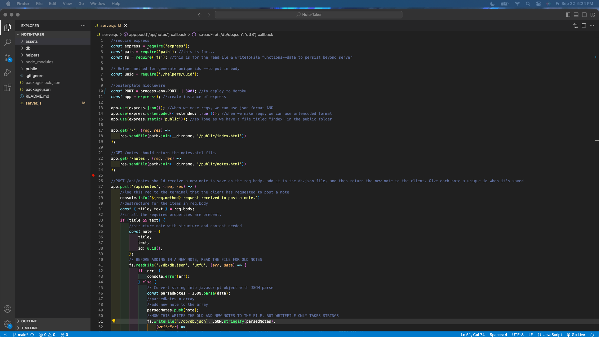
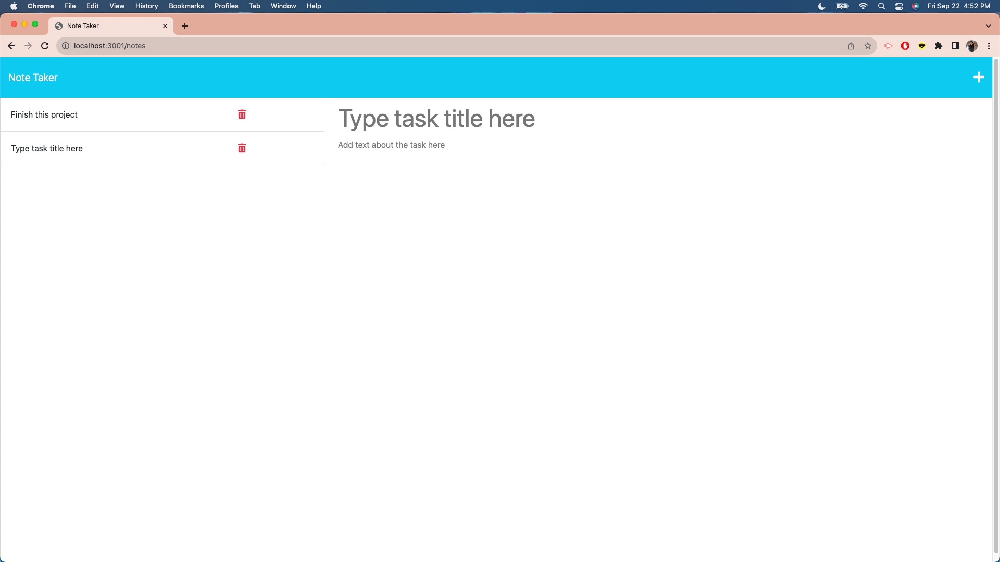

# Note-Taker

## Table of Contents
- [Description](#description)
- [Installation](#installation)
- [Usage](#usage)
- [License](#license)
- [Contribution](#contribution)
- [Tests](#tests)
- [Questions](#questions)

## Description
The purpose of creating a Note-Taker application is so that users can write and save notes to track tasks they need to complete. Once the user clicks “Get Started” on the front page, the user is then directed to the Note Taker page where they input the title and text of the task. Once they do, they click the save icon in the upper righthand corner to save the task. Tasks will show up on the left side of the same page. The tasks will still persist through page refreshes. See (#tests) for a step-by-step. See the deployed application on Heroku here: TO BE LINKED

## Installation
Clone the starter code here for the front end coding of the application: https://github.com/coding-boot-camp/miniature-eureka. VS Code to code the back end of the application. GibHub for version control. This application uses Express.js for its back end, which is already noted in the package.json of the starter code. Downloading Insomnia is optional to test the GET and POST calls: https://insomnia.rest/download.

## Usage
This can be used when users want to track what tasks they need to complete.

View a screenshot of the functions for imports and boilerplate middleware:

View a screenshot of the POST call in VS Code:

View a screenshot of the GET calls and port listener in VS Code:

## License
This project is under the MIT license.

## Contribution
The coding in the server.js file (imports, boilerplate middleware, port listener, GET and POST calls, conditional statements, writeToFile method, readFile method, JSON.parse, JSON.stringify, folder/file arrangements and naming conventions, and Heroku deployment) -all the additions- are credited to the curriculum taught in the UCI coding boot camp by the instructor in the UCI coding boot camp. I received additional help from the class’s TA and coding boot camp tutor to provide further guidance with the JSON concepts.

To complete the README with screenshots, the source for the code is: https://stackoverflow.com/questions/10189356/how-to-add-screenshot-to-readmes-in-github-repository.
To complete the README section, the source is: https://coding-boot-camp.github.io/full-stack/github/professional-readme-guide.
To complete the markdown for the README, the source is: https://www.markdownguide.org/basic-syntax/
https://gist.github.com/lukas-h/2a5d00690736b4c3a7ba
.

## Tests
To test this Note-Taker application, users can clone this repo, run npm install, and type “node server” in the command line in their terminal. Click the link in the message when it pops up “App listening at http://localhost:3001”. 
Click “Get Started”:

The Note Taker page loads:

Add the title of the task and text about the task as indicated in the screenshot:

After adding the title and text, click the save icon in the upper right corner to save the task, which will then look like this:

Click on the task to focus on it:

Refresh the page to see that the task still persists. Open up the db.json file to see the task.

Users can also test this Note-Taker application by following the same steps described above with the deployed application on Heroku.

## Questions
The link to my Github Profile here: https://github.com/codeandlift706.
For any additional questions, please reach me at: channguyen715@gmail.com.
